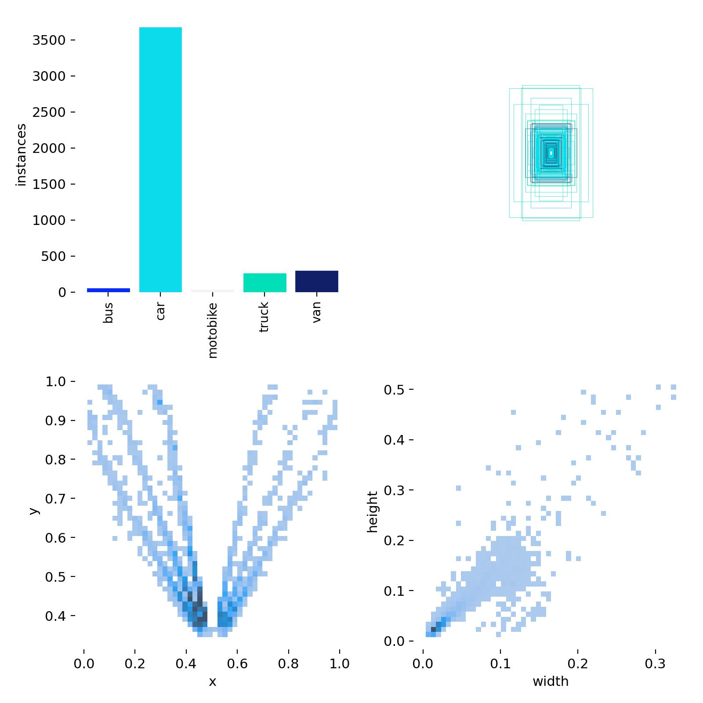
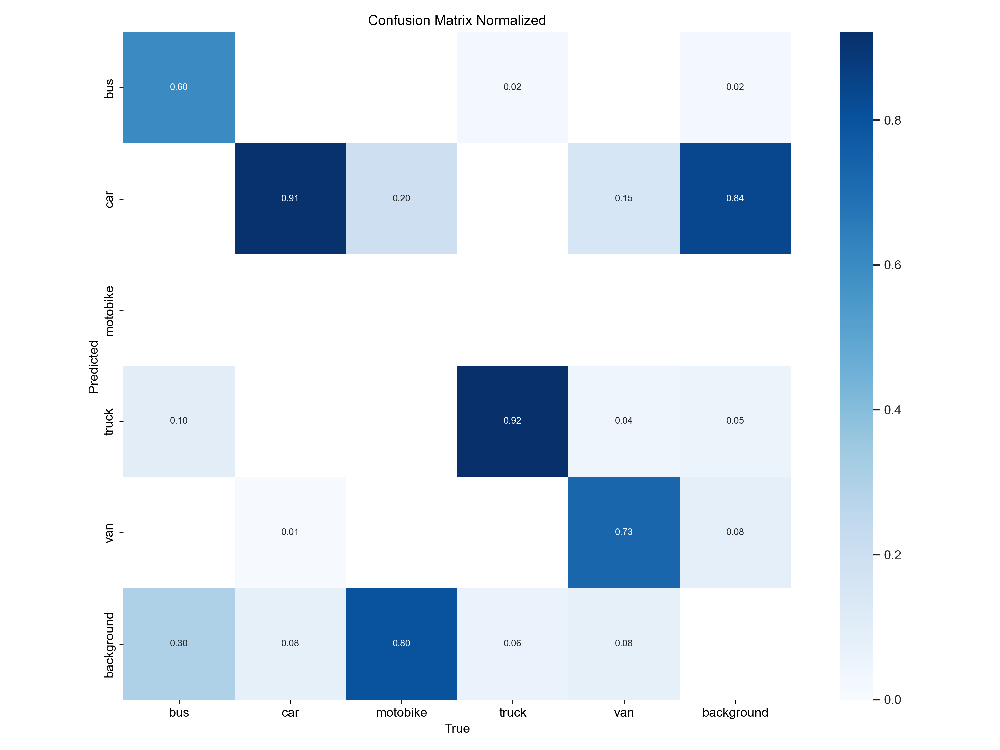

# YOLOv10 usage - Vehicle Detection
Salutations to all the readers of this repository. This repository just contains the code (test and training) for the neweset version of YOLO (up to the push date). It presents the usage of YOLOv10 for vehicle detection.
## Rescources
YOLOv10 was developed by the THU-MIG group, a research group from Tsinghua University. Written by Ao Wang, Hui Chen*, Lihao Liu, Kai Chen, Zijia Lin, Jungong Han, Guiguang Ding*. The paper was published on arXiv on 23 May 2024, via the link [here](https://arxiv.org/abs/2405.14458) and the code is available on the GitHub repository [here](https://github.com/THU-MIG/yolov10).
## Test the original YOLOv10
Before starts, I want to see how the prediction of the original YOLOv10 is. So, I will use the pretrained weights of the original YOLOv10 and test it on a sample video [video.mp4](./data/test_data/0621.mp4) with `YOLOv10-S` is chosen. The result saved in the `runs\detect\predict` folder.  
> From the test result, the original YOLOv10 is just able to detect cars and trucks. It can't detect more specific vehicles like buses, motorcycles, etc. So, I will fine-tune the YOLOv10 to detect more specific vehicles.
## Fine-tune YOLOv10
### Prepare the dataset
The dataset was created from the YouTube video [PNCJQkvALVc](https://www.youtube.com/watch?v=PNCJQkvALVc) and roboflow was used to hand-label the frames. But I just labeled 246 frames cuz limited time. The dataset is divided into 3 parts: train (75%), validation (20%), and test (5%). The dataset is available here [dataset](./data/Vehicle_Detection.yolo)
The dataset is in the YOLO format and encompasses the following classes:
- bus
- car
- motorcycle
- truck
- van
### Train the model
The model was trained on Anaconda environment on my local machine. The training process was done with 200 epochs. The training process can be seen in the [train6](./runs/detect/train6) and the best weights were saved in the [train6/weights](./runs/detect/train6/weights/) folder.

The distribution of the training dataset is illustrated in the following graph:

> As you can see, the dataset is imbalanced. The number of cars is much higher than the other classes and the number of bus and motorcycles are tiny. Hence, the model may not be able to detect well, we need larger dataset to train the model better.

You can also see the confusion matrix of the training process in the following graph:

### Test the fine-tuned model
Let's test the fine-tuned model on a sample picture:

The prediction result:

> Pretty good, right? The model can detect all the vehicles in this picture.

Then, let's test the model on a sample video, we can see the result:

> Hmm, feel like the model needs more training to detect the vehicles better. But, it's okay for now. You can try to train the model with a larger dataset to get better results.
## Conclusion
The YOLOv10 Real-Time E2E Object Detection model is a powerful model for dectection. After training to have a more specific vehicle detection, the model can detect the vehicles in real-time from the video (camera).

### Thank you for reading this README. Have a nice day!
